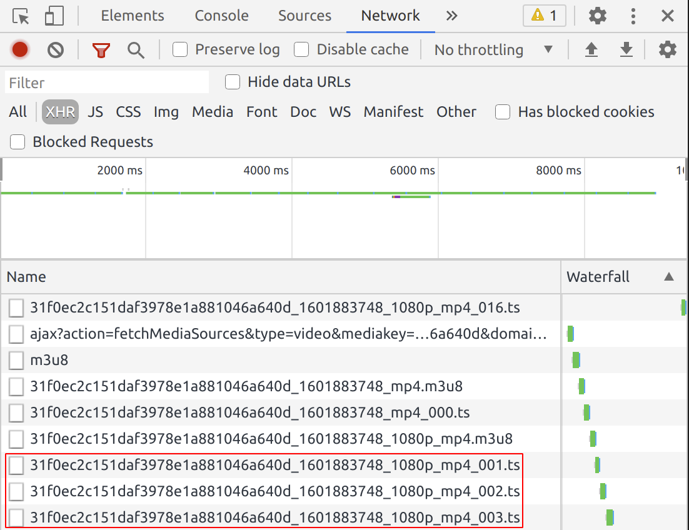
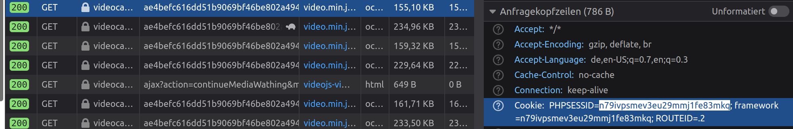

# Installation
1. Install Python 3
2. Download ZIP or clone the repository
3. Enter the videocampus-sachsen-downloader directory
4. Execute `./install.sh` to install the program

# Usage
1. Open a terminal and write `vcs-downloader`
2. Enter the video stream URL
3. Give the file a name and wait for the download to finish

# Retrieving the video stream URL
1. Open the console of your browser (F12) and select the Network Inspector Tab
2. Select the XHR request type and start playing the Video
3. Now right click one of the marked URLs with a .ts file extension and copy the URL as seen on the image below.

# Authentication
Sometimes the application may prompt you for authentication. In that case just copy the PHPSESSID from your browser, so that the downloader can authenticate aswell.

